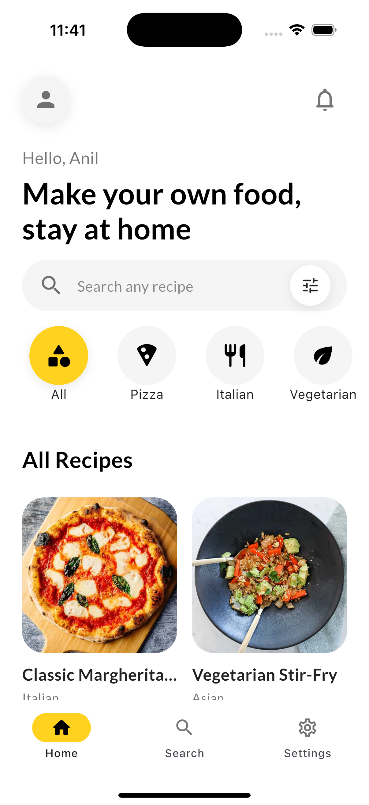
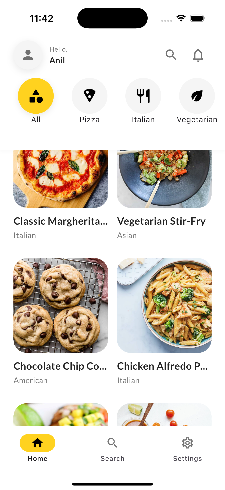
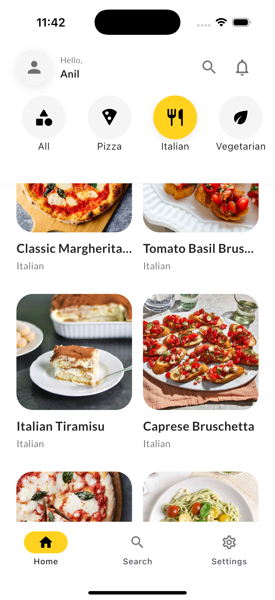
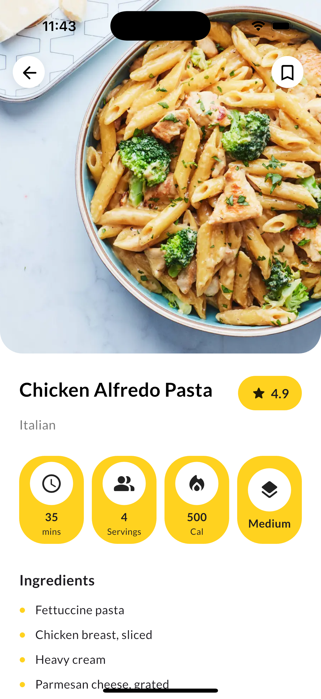
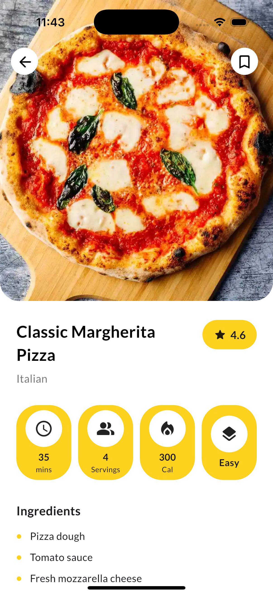
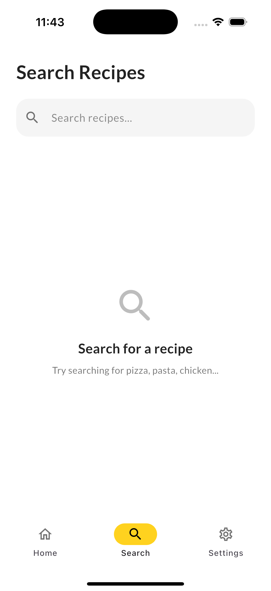
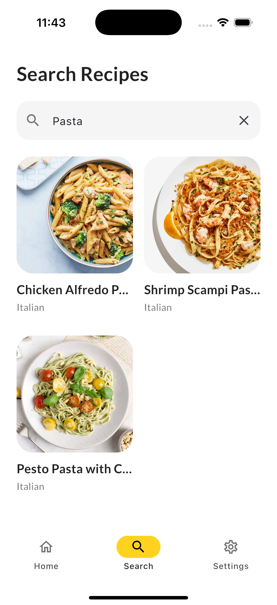
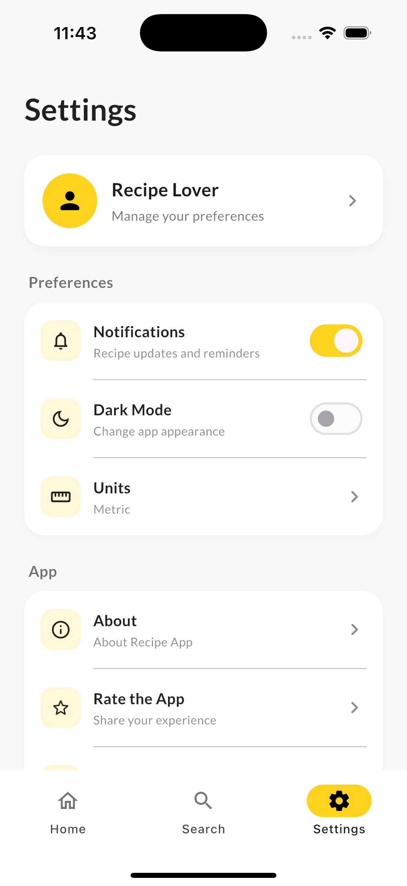

# 🍳 Recipes App

A modern Flutter recipe application where users can browse recipes, filter recipes by category, search for recipes, and view detailed recipe information with smooth Hero animations.

## 🛠️ Tech Stack

- Flutter & Dart
- Riverpod – State management
- Dio – HTTP networking
- Retrofit – API integration
- JSON Serializable – JSON parsing
- Google Fonts – Typography
- Material 3 – UI
- Hero Animation – Shared element transition

## 🌐 API

This project uses the DummyJSON Recipes API.

**Base URL:**  
https://dummyjson.com/

### Endpoints

**Get all recipes**
```text
GET /recipes?limit=0
```

**Get recipe categories/tags**
```text
GET /recipes/tags
```

**Get recipes by category**
```text
GET /recipes/tag/{tag}
```

**Search recipes**
```text
GET /recipes/search?q={query}
```

## 🏗️ Project Structure

```text
lib/
├── data/
│   ├── datasources/
│   ├── models/
│   └── repositories/
│
├── domain/
│   ├── repositories/
│   └── usecases/
│
├── presentation/
│   ├── screens/
│   ├── viewmodels/
│   ├── states/
│   ├── providers/
│   └── widgets/
│
└── main.dart
```

### Architecture Flow

```text
Screen
   ↓
ViewModel
   ↓
UseCase
   ↓
Repository
   ↓
Remote Data Source
   ↓
Retrofit / Dio
   ↓
API
```

## 📱 Project Overview

The application contains three main sections:

- **Home** – Browse all recipes and filter recipes by category.
- **Search** – Search recipes using the DummyJSON API.
- **Settings** – Static settings UI.

The recipe details screen receives the selected `RecipeModel` directly from the recipe card, so no additional API call is required.

Recipe images use Flutter's **Hero animation** to create a shared element transition between the recipe card and recipe details screen.

The application also includes:

- Shimmer loading states
- Image loading indicators
- Category filtering
- Recipe search
- Recipe details
- Bottom navigation
- Reusable UI components

## 📸 Screenshots

### 🎥 Demo

<p align="center">
  
</p>

---

### 🏠 Home

<table>
  <tr>
    <td align="center">
      
    </td>
    <td align="center">
      
    </td>
    <td align="center">
      
    </td>
  </tr>
</table>

---

### 📖 Recipe Details

<table>
  <tr>
    <td align="center">
      
    </td>
    <td align="center">
      
    </td>
  </tr>
</table>

---

### 🔍 Search

<table>
  <tr>
    <td align="center">
      
    </td>
    <td align="center">
      
    </td>
  </tr>
</table>

---

### ⚙️ Settings

<table>
  <tr>
    <td align="center">
      
    </td>
  </tr>
</table>

## 👨‍💻 Author

**Anil Kumar**

Android & Flutter Developer
